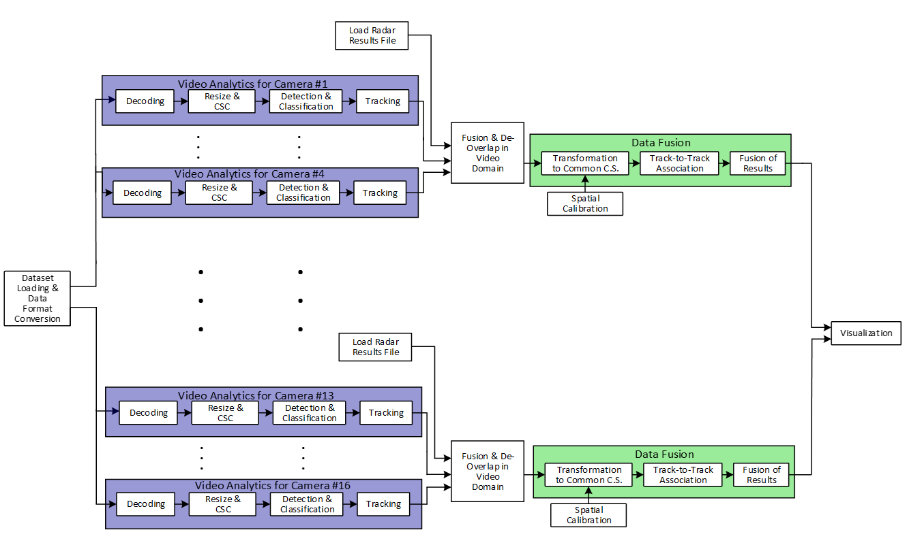

# How It Works

This reference implementation enables the development of a high-performance, Intel-based® Intelligent Traffic Solution. The end-to-end pipeline of this software reference implementation includes the following major workloads, as shown in the following figure: 

- Dataset loading and data format conversion
- Radar signal processing
- Video analytics
- Data fusion
- Visualization
  

Each pipeline is deployed on a single Intel® SoC processor, providing the necessary heterogeneous compute capabilities from Intel Core™ processors and integrated GPU. The implementation includes video analytics optimized by the Intel® Distribution of OpenVINO™ Toolkit, radar signal processing accelerated by Intel® oneMKL, data fusion, and visualization. Key performance indicators, such as throughput and processing latency, significantly surpass current market standards. To maximize performance on Intel® processors, we optimized this SW RI using Intel software toolkits and open-source libraries.

Use case #1: 1C+1R Pipeline

Use case #2: 4C+4R Pipeline

Use case#3: 2C+1R 

Use case#4: 16C+4R 

Following are the four demo configurations. Please refer to the [Get Started Guide](./Get-Started-Guide.md) for more instructions on deploying services on bare metal.  

## Demo for 1C+1R

Use case #1: 1C+1R running on Intel® Celeron® Processor 7305E 

## Demo for 4C+4R

Use case #2: 4C+4R running on Intel® Core™ Ultra 7 Processor 165H 

## Demo for 2C+1R

Use case #3: 2C+1R running on Intel® Celeron® Processor 7305E 

## Demo for 16C+4R

Use case #4: 16C+4R running on Intel® Core™ i7-13700 and Intel® Arc™ A770 Graphics 

## Key Features

* Powerful and scalable CPU, built-in GPU (iGPU) configurations that deliver heterogeneous computing capabilities for sensor fusion-based AI inferencing. 

* Low power consumption package with a wide temperature range, compact fanless design, and enhanced vibration resistance. 

* Processors designed for industrial and embedded conditions, ensuring high system reliability. 

* Optimized software reference implementation based on open-source code to support performance evaluation, rapid prototyping, and quick time-to-market. 

* Rugged and compact PC design to withstand harsh in-vehicle environmental conditions. 

## Benefits

* **Enhanced AI Performance**: Achieve superior AI performance with our recommended optimization techniques, rigorously tested on industry-leading AI models and sensor fusion workloads. 

* **Accelerated Time to Market**: Speed up your development process by leveraging our pre-validated SDK and Intel-powered qualified AI Systems, ensuring a quicker path from concept to deployment. 

* **Cost Efficiency**: Lower your development costs with royalty-free developer tools and cost-effective hardware platforms, ideal for prototyping, development, and validation of edge AI traffic solutions. 

* **Simplified Development**: Reduce complexity with our best-known methods and streamlined approach, making it easier to build an intelligent traffic management system.  

##	System Requirements

- Hardware requirements

    - Platform

        - Intel® Celeron® Processor 7305E (1C+1R/2C+1R usecase)
        - Intel® Core™ Ultra 7 Processor 165H (4C+4R usecase)

        - Intel® Core™ i7-13700 and Intel® Arc™ A770 Graphics (16C+4R usecase)

    - BIOS setting

        - MTL

            | Setting                                          | Step                                                         |
            | ------------------------------------------------ | ------------------------------------------------------------ |
            | Enable the Hidden BIOS Setting in Seavo Platform | "Right Shift+F7" Then Change Enabled Debug Setup Menu from [Enabled] to [Disable] |
            | Disable VT-d in BIOS                             | Intel Advanced Menu → System Agent (SA) Configuration → VT-d setup menu → VT-d<Disabled>     Note: If VT-d can’t be disabled, please disable Intel Advanced Menu → CPU Configuration → X2APIC |
            | Disable SAGV in BIOS                             | Intel Advanced Menu → [System Agent (SA) Configuration]  →  Memory configuration →  SAGV <Disabled> |
            | Enable NPU Device                                | Intel Advanced Menu → CPU Configuration → Active SOC-North Efficient-cores <ALL>    Intel Advanced Menu → System Agent (SA) Configuration → NPU Device <Enabled> |
            | TDP Configuration                                | SOC TDP configuration is very important for performance. Suggestion: TDP = 45W. For extreme heavy workload, TDP = 64W  ---TDP = 45W settings: Intel Advanced → Power & Performance → CPU - Power Management Control → Config TDP Configurations → Power Limit 1 <45000>  ---TDP = 64W settings: Intel Advanced → Power & Performance → CPU - Power Management Control → Config TDP Configurations →  Configurable TDP Boot Mode [Level2] |

        - RPL-S+A770

            | Setting                  | Step                                                         |
            | ------------------------ | ------------------------------------------------------------ |
            | Enable ResizeBar in BIOS | Intel Advanced Menu -> System Agent (SA) Configuration -> PCI Express Configuration -> PCIE Resizable BAR Support <Enabled> |

    

- Software requirements

    | Software           | Version                |
    | ------------------ | ---------------------- |
    | Intel  OpenVINO    | 2024.6.0               |
    | Intel  oneMKL      | 2025.1.0               |
    | NEO OpenCL         | Release/23.22.26516.25 |
    | cmake              | 3.22.1                 |
    | boost              | 1.83.0                 |
    | spdlog             | 1.8.2                  |
    | thrift             | 0.18.1                 |
    | gRPC               | 1.58.1                 |
    | zlib               | 1.2.11                 |
    | oneAPI Level  Zero | 1.17.19                |

## Get Started

- [Get-Started-Guide.md](./Get-Started-Guide.md)
- [Advanced-User-Guide.md](./Advanced-User-Guide.md)
- [APIs.md](./APIs.md)

##	Getting Help

- [FAQ.md](./FAQ.md)

