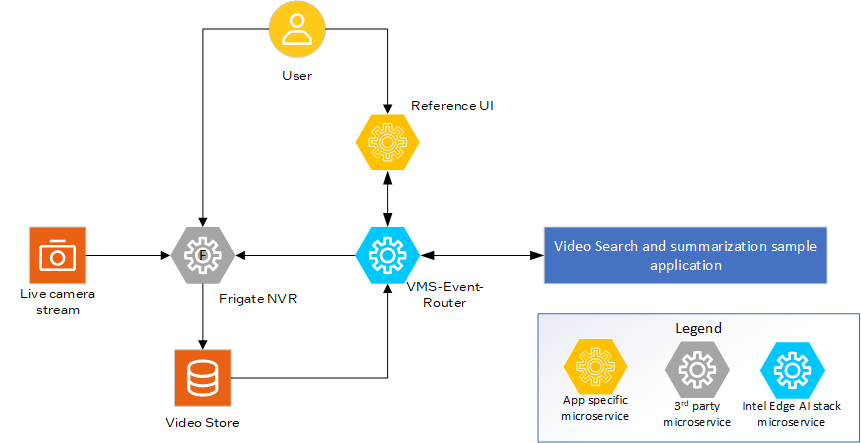

# Smart NVR Overview

Provides GenAI-powered vision analytics to transform a traditional NVR into a Smart NVR, unlocking advanced insights and automation at the edge.

## Overview

The **Smart NVR** leverages GenAI-enabled vision analytics pipelines to convert conventional network video recorders into intelligent, context-aware systems. By processing video streams directly at the edge, the Smart NVR dramatically reduces the volume of data that needs to be transmitted or stored, while enabling real-time detection, summarization, and actionable insights. This approach not only optimizes bandwidth and storage but also empowers organizations to respond faster to critical events and extract more value from their video infrastructure.

### Example Use Cases

- **Pedestrian and Vehicle Safety:** Detects and analyzes unsafe situations at intersections, such as pedestrians outside crosswalks or vehicles violating traffic rules, enabling timely alerts and interventions.
- **Traffic Flow Optimization:** Measures vehicle counts, average dwell times, and congestion patterns to support adaptive traffic signal control and urban planning.
- **Perimeter Security:** Identifies unauthorized access or suspicious behavior in restricted zones, providing real-time notifications to security personnel.
- **Asset and Facility Monitoring:** Tracks movement of assets, vehicles, or personnel across large facilities, supporting logistics and operational efficiency.
- **Incident Summarization:** Automatically generates concise summaries of noteworthy events (e.g., accidents, near-misses) for rapid review and compliance reporting. This use case can also be referred to as _Video Forensics_ usages.

### Key Benefits

- **Edge-Optimized Analytics:** Processes video data locally, reducing bandwidth usage and enabling faster response times.
- **Multi-Sensor Fusion:** Integrates data from cameras and other sensors (e.g., lidar, radar) for richer scene understanding and more accurate event detection.
- **Scalable and Modular Architecture:** Built on microservices, allowing easy integration of new analytics capabilities and seamless scaling across deployments.
- **Simplified Business Logic:** Scene-based analytics and flexible region-of-interest configuration streamline rule creation and maintenance, even as camera layouts or sensor types evolve.
- **Future-Proof and Cost-Efficient:** Works with existing camera infrastructure, lowers total cost of ownership, and supports the addition of new sensors or analytics without major system

## How it Works
This section provides a high-level architecture view of the Smart NVR application and how it integrates with different video analytics pipelines.

### Key Components
The diagram shows the key components of the Smart NVR application. The description below provides a high-level description of the components and how these components come together to support the features.

- **Frigate NVR**:
  - Frigate NVR is used as reference NVR as a proxy for any NVR that can be converted to Smart NVR. Refer to [Frigate](https://frigate.video/) documentation for details on Frigate.
  - Frigate is responsible for accepting live video input from different _Cameras_ and store the same in _Video store_. Frigate supports [APIs](https://docs.frigate.video/integrations/api/frigate-http-api) that can be used to get access to the videos stored in the Video store.
  - **[Experimental] GenAI Integration**: When enabled (`NVR_GENAI=true`), Frigate can leverage the OEP VLM Microservice to generate AI-powered event descriptions for enhanced video analytics.

- **NVR Event Router**:

  NVR Event Router is the glue layer between the (Frigate) NVR and the video analytics pipeline. This component serves two primary objectives.
    - It helps track the events raised by the NVR and connect the events of interest to the Video analytics pipeline like [Video search and summary](https://github.com/open-edge-platform/edge-ai-libraries/tree/main/sample-applications/video-search-and-summarization) application. The events of interest are determined by the query raised by the user. Video associated with the event can be further processed by the video analytics pipelines.
    - It provides mechanism to configure the applications available under video analytics category as appropriate to the target use cases. [Video search and summary](https://github.com/open-edge-platform/edge-ai-libraries/tree/main/sample-applications/video-search-and-summarization) sample application and [Image based Video Search](https://github.com/open-edge-platform/edge-ai-suites/tree/release-1.2.0/metro-ai-suite/image-based-video-search) sample application are two example pipelines. The latter is not integrated yet as part of Smart NVR offering.

- **Reference UI**

  A Gradio based UI helps exercise all the capabilities of the NVR Event Router. The capabilities supported in the UI can be directly mapped to the feature set of the sample application.

### Key Features
- **Feature 1**: Architecture based on modular microservices enables composability and reconfiguration.
- **Feature 2**: Connects to available video analytics pipeline applications like [Video search and summary](https://github.com/open-edge-platform/edge-ai-libraries/tree/main/sample-applications/video-search-and-summarization) sample application and [Image based Video Search](https://github.com/open-edge-platform/edge-ai-suites/tree/release-1.2.0/metro-ai-suite/image-based-video-search) sample application.
- **Feature 3**: Independent Gradio based UI allows extending the capability of Smart NVR sample application independent of the integrated video analytics sample applications.
- **Feature 4**: **[Experimental] AI-Powered Event Descriptions**: Optional integration with OEP VLM Microservice to generate intelligent, context-aware descriptions of detected events using vision-language models.

## Learn More

- [System Requirements](./system-requirements.md): Check the hardware and software requirements for deploying the application.
- [Get Started](./get-started.md): Follow step-by-step instructions to set up the application.
- [How to build from source](./how-to-build-from-source.md): How to build and deploy the application using Docker Compose.
- [How to Use the Application](./how-to-use-application.md): Explore the application's features and verify its functionality.
- [Support and Troubleshooting](./Troubleshooting.md): Find solutions to common issues and troubleshooting steps.