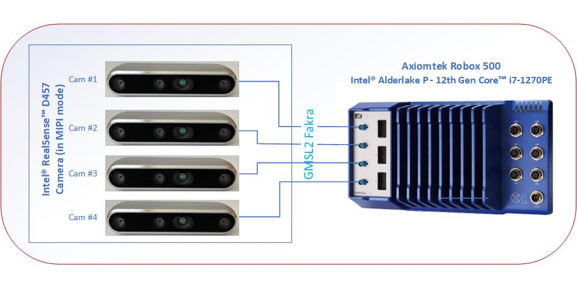
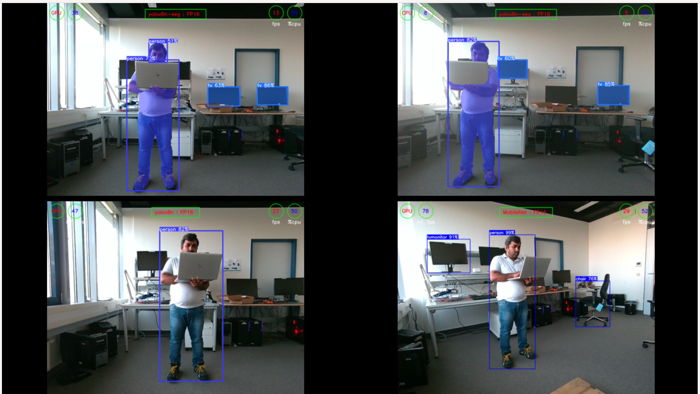

# Multi-Camera Demo

In this demo four instances of AI applications for object detection are run in parallel using four RealSense™ camera stream. In this demo, the Ultralytics YOLOv8 model and mobilenet-ssd model are downloaded and used for object detection and segmentation.

Here, the multicamera usecase is demonstrated using an Axiomtek Robox500 Industrial PC and 4x Intel® RealSense™ GMSL/FAKRA Stereo Camera D457. The Axiomtek Robox500 industrial PC consists of an 12th Gen Intel® Core™ i7-1270PE, 28W Alderlake P Processor and an Intel® Iris® Xe Graphics iGPU. However, this demo can be run on any Intel® platform which has a GPU and also with 4x USB Intel® RealSense™ cameras.

The setup looks like as described in the table below.
<!-- markdownlint-disable MD033 -->
|Camera  |AI Model          |AI Workload                     |Device|
|--------|------------------|--------------------------------|------|
|Camera-1|YOLOv8n-seg:FP16  |<ul><li>Object detection</li><li>Segmentation|GPU   |
|Camera-2|YOLOv8n-seg:FP16  |<ul><li>Object detection</li><li>Segmentation|CPU   |
|Camera-3|YOLOv8n:FP16      |Object detection                |GPU   |
|Camera-4|moblienet-ssd:FP16|Object detection                |GPU   |

## Component Documentation

Comprehensive documentation on this component is available here: [dev guide](https://docs.openedgeplatform.intel.com/edge-ai-suites/robotics-ai-suite/main/robotics/dev_guide/tutorials_amr/perception/openvino/pyrealsense2_d457_multicam_object_detection_tutorial.html)

## Dependencies

### Axiomtek Robox500 platform setup

The following steps are required in order to enable Axiomtek Robox500 platform to support 4x Intel® RealSense™ GMSL/FAKRA Stereo Camera D457.

To start with, connect the 4x Intel® RealSense™ GMSL/FAKRA Stereo Camera D457 to the Axiomtek Robox500 platform as shown in the below picture. Remove any USB Intel® RealSense™ cameras if connected. Now, power-on the target.



#### BIOS Settings

Press "Del" or "Esc" button at boot to go into the BIOS. Once in the BIOS, set the following BIOS settings.

* Intel Advanced Menu -> Power & Performance -> CPU-Power Management Control -> C States -> < Disable > (Note: If enabled, fps drops)
* Intel Advanced Menu -> System Agent (SA) Configuration -> MIPI Camera Configuration -> < Enable > (Note: Enable all four cameras in this menu)

|BIOS Setting       |Camera 1|Camera 2|Camera 3|Camera 4|
|-------------------|--------|--------|--------|--------|
|MIPI Port          |0       |1       |2       |3       |
|LaneUser           |x2      |x2      |x2      |x2      |
|PortSpeed          |2       |2       |2       |2       |
|I2C Channel        |I2C5    |I2C5    |I2C5    |I2C5    |
|Device0 I2C Address|12      |14      |16      |18      |
|Device1 I2C Address|42      |44      |62      |64      |
|Device2 I2C Address|48      |4a      |68      |6C|

#### Prerequisites

* [Prepare the target system](https://docs.openedgeplatform.intel.com/edge-ai-suites/robotics-ai-suite/main/robotics/gsg_robot/prepare-system.html)
* [Setup the Robotics AI Dev Kit APT Repositories](https://docs.openedgeplatform.intel.com/edge-ai-suites/robotics-ai-suite/main/robotics/gsg_robot/apt-setup.html)
* [Install OpenVINO™ Packages](https://docs.openedgeplatform.intel.com/edge-ai-suites/robotics-ai-suite/main/robotics/gsg_robot/install-openvino.html)
* [Install Robotics AI Dev Kit Deb packages](https://docs.openedgeplatform.intel.com/edge-ai-suites/robotics-ai-suite/main/robotics/gsg_robot/install.html)
* [Install the Intel® NPU Driver on Intel® Core™ Ultra Processors (if applicable)](https://docs.openedgeplatform.intel.com/edge-ai-suites/robotics-ai-suite/main/robotics/gsg_robot/install-npu-driver.html)

#### Install iGPU drivers on 12th Gen Intel® Core™ i7 processor

Run the below command to check for the iGPU driver on 12th Gen Intel® Core™ i7 processor.

```bash
# Install clinfo
$ sudo apt install -y clinfo

# clinfo command to check GPU device
$ clinfo | grep -i "Device Name"
$ clinfo | grep -i "Device Name"
    Device Name                                   Intel(R) Iris(R) Xe Graphics
    Device Name                                   Intel(R) FPGA Emulation Device
    Device Name                                   12th Gen Intel(R) Core(TM) i7-1270PE
    Device Name                                   Intel(R) Iris(R) Xe Graphics
    Device Name                                   Intel(R) Iris(R) Xe Graphics
    Device Name                                   Intel(R) Iris(R) Xe Graphics
```

Follow the below steps only in case the above iGPU driver is not installed.

1. The steps to install iGPU driver on 12th Gen Intel® Core™ i7 processor is described here:
[Configurations for Intel® Processor Graphics (GPU) with OpenVINO™](https://docs.openvino.ai/nightly/openvino_docs_install_guides_configurations_for_intel_gpu.html#)

2. Reboot the target after installation.

#### Install intel-ipu6 driver

1. Create a /etc/modprobe.d/blacklist-ipu6.conf file and add the following. This will prevent the loading of the existing intel_ipu6_isys driver.

    ```bash
     # kernel builtin IPU6 and Realsense D4xx driver clash with intel-ipu6-dkms
     blacklist intel_ipu6_isys
     blacklist intel_ipu6_psys
     blacklist intel_ipu6
    ```

2. Reboot the target.
3. Install the intel-ipu6-dkms.

   ```bash
    sudo apt install intel-ipu6-dkms
   ```

4. Run the following command for dkms to force install the intel-ipu6 driver.

   ```bash
     dkms install --force ipu6-drivers/20230621+iotgipu6-0eci8
   ```

5. Check the dkms status by running the following command.

   ```bash
    $ dkms status
    ipu6-drivers/20230621+iotgipu6-0eci8, 5.15.0-1048-intel-iotg, x86_64: installed
   ```

6. Manually modprobe the installed intel-ipu6 driver.

   ```bash
     sudo modprobe intel-ipu6-isys
   ```

7. Once installed check the status of the intel-ipu6 driver using the below command. The file loaded must be: ***/lib/modules/5.15.0-1048-intel-iotg/updates/dkms/intel-ipu6-isys.ko*** as shown below.

   ```bash
    $ modinfo intel-ipu6-isys | head -3
    filename:       /lib/modules/5.15.0-1048-intel-iotg/updates/dkms/intel-ipu6-isys.ko
    description:    Intel ipu input system driver
    license:        GPL
   ```

#### Install librealsense2 and RealSense tools

Install the librealsense2 and the RealSense tools using the below commands.

```bash
sudo apt install ros-humble-librealsense2-tools
```

#### Add the USER to the video and render group

Add the $USER to the video and render group using the following command.

```bash
 sudo usermod -a -G video $USER
 sudo usermod -a -G render $USER
```

## Build from sources

1. [Prepare the target system](https://docs.openedgeplatform.intel.com/edge-ai-suites/robotics-ai-suite/main/robotics/gsg_robot/prepare-system.html)

2. Clone the repository - [edge-ai-suites](https://github.com/open-edge-platform/edge-ai-suites)

   ```bash
     git clone --recursive https://github.com/open-edge-platform/edge-ai-suites -b release-1.2.0
   ```

3. Update the dependencies.

   ```bash
     sudo apt update
   ```

4. Build the package.

   ```bash
     cd edge-ai-suites/robotics-ai-suite/components/multicam-demo
     mk-build-deps -i --host-arch amd64 --build-arch amd64 -t "apt-get -y -q -o Debug::pkgProblemResolver=yes --no-install-recommends --allow-downgrades" debian/control
     dpkg-buildpackage
   ```

## Install

If the debian package is built from the sources then the .deb file is generated in the parent directory. Further, the debian package can also be downloaded and installed from Robotics SDK APT repo. Install the realsense-d457-ai-demo by using the following command.

```bash
sudo apt install ros-humble-pyrealsense2-ai-demo
```

---
**Note:**

The ros-humble-pyrealsense2-ai-demo installation will also do the following:

* Installs all the python dependency packages needed for the demo to run.
* Downloads the YOLOv8 model files from Ultralytics and generate the models.
* Download and build the mobilenet-ssd model using the omz_downloader.

The installation will run for 25-30 minutes and consumes approx 2GB of the disk space.

---

## Running on Axiomtek Robox500 using 4x Intel® RealSense™ GMSL/FAKRA Stereo Camera D457

Run the below command to start the application.

```bash
$ . /opt/ros/humble/share/pyrealsense2-ai-demo/venv/bin/activate
$ source /opt/ros/humble/setup.bash

# Command to run the demo application for 4x camera input streams.
$ python3 /opt/ros/humble/bin/pyrealsense2_ai_demo_launcher.py --config=/opt/ros/humble/share/pyrealsense2-ai-demo/config/config_ros2_v4l2_rs-color-0_3.js
```

All the four cameras are started, after approx 15-20sec, as shown in the below picture.


---
**Note:**

Use the config file

* config_ros2_v4l2_rs-color-0.js to run the demo for 1x camera input stream.
* config_ros2_v4l2_rs-color-0_1 to run the demo for 2x camera input streams.
* config_ros2_v4l2_rs-color-0_2 to run the demo or 3x camera input streams.

---

## Troubleshoot and workarounds

1. ***iGPU driver not found even after installing the driver.***

   For example:

   ```bash
    $ sudo intel_gpu_top
    intel_gpu_top: ../tools/intel_gpu_top.c:1909: init_engine_classes: Assertion `max >= 0' failed.
    Aborted
   ```

   **Solution**: The issue is resolved by creating the following symbolic link.

   ```bash
     sudo ln -s /lib/firmware/i915/adlp_guc_70.1.1.bin /lib/firmware/i915/adlp_guc_70.0.3.bin
   ```

2. ***Stability issue or GPU hang error.***

One of the windows get stuck and GPU hang error is observed 2 out 5 runs of the demo when it is run for more than 10-15mins with 3x or more instances of AI workload is run on iGPU.

   ```bash
    [ 1228.692171] perf: interrupt took too long (3136 > 3126), lowering kernel.perf_event_max_sample_rate to 63750
    [ 1675.286683] perf: interrupt took too long (3924 > 3920), lowering kernel.perf_event_max_sample_rate to 50750
    [ 1828.865938] Asynchronous wait on fence 0000:00:02.0:gnome-shell[991]:2c6c0 timed out (hint:intel_atomic_commit_ready [i915])
    [ 1831.944273] i915 0000:00:02.0: [drm] GPU HANG: ecode 12:1:8ed9fff2, in python3 [6414]
    [ 1831.944340] i915 0000:00:02.0: [drm] Resetting chip for stopped heartbeat on rcs0
    [ 1831.944474] i915 0000:00:02.0: [drm] python3[6414] context reset due to GPU hang
    [ 1831.944563] i915 0000:00:02.0: [drm] GuC firmware i915/adlp_guc_70.0.3.bin version 70.1
    [ 1831.944565] i915 0000:00:02.0: [drm] HuC firmware i915/tgl_huc_7.9.3.bin version 7.9
    [ 1831.961857] i915 0000:00:02.0: [drm] HuC authenticated
    [ 1831.962252] i915 0000:00:02.0: [drm] GuC submission enabled
    [ 1831.962254] i915 0000:00:02.0: [drm] GuC SLPC enabled
   ```

**Solution**: The issue is resolved by adding the following kernel command line argument into the grub file. This will disable the dynamic power management of the GPU.
Open the /etc/default/grub file. Add the following to the **GRUB_CMDLINE_LINUX**, save the file and update the grub.

   ```bash
    # Add the following line to the /etc/default/grub file
    GRUB_CMDLINE_LINUX="i915.enable_dc=0"

    # Save the file and do update grub
    $ sudo update-grub
   ```

Reboot the system.
