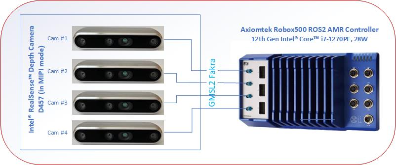
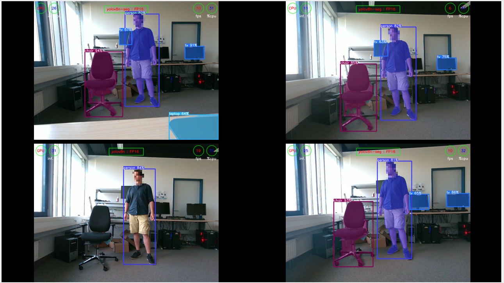

# OpenVINO™ Tutorial on Multi-camera Object Detection using Intel® RealSense™ Depth Camera D457

---

In this tutorial, the multi-camera use case is demonstrated using an
[Axiomtek Robox500 ROS2 AMR
Controller](https://www.axiomtek.com/Default.aspx?MenuId=Products&FunctionId=ProductView&ItemId=27392&C=ROBOX500&upcat=408)
and four [Intel® RealSense™ Depth Camera
D457](https://www.intelrealsense.com/depth-camera-d457/). Here, the four
cameras are connected to the Industrial Gigabit Multimedia Serial Link™
(GMSL) supported Axiomtek Robox500 ROS2 AMR Controller through
GMSL/FAKRA (female-to-female) cables, which provide high-bandwidth video
transmission.

Four instances of AI-based applications for object detection and object
segmentation are run in parallel using four Intel® RealSense™ camera
streams. Further in this tutorial, the [Ultralytics
YOLOv8](https://docs.ultralytics.com/) model is downloaded and used for
object detection and object segmentation. The tutorial can be run on an
Axiomtek Robox500 ROS2 AMR Controller consisting of either a 12th Gen
Intel® Core™ i7-1270PE processor or a 13th Gen Intel® Core™ i7-1370PE
processor, both with 28W TDP and an Intel® Iris® X^e^ Integrated
Graphics Processing Unit.

The setup looks like as described in the table below.

  | Camera    | AI model          | AI Workload                     | Device |
  | --------- | ----------------- | ------------------------------- | -------|
  | Camera-1  | YOLOv8n-seg:FP16  | Object detection & segmentation | GPU    |
  | Camera-2  | YOLOv8n-seg:FP16  | Object detection & segmentation | CPU    |
  | Camera-3  | YOLOv8n:FP16      | Object detection                | GPU    |
  | Camera-4  | YOLOv8n-seg:FP16  | Object detection & segmentation | GPU    |

## Intel® RealSense™ Depth Camera D457 Multi-camera Object detection setup

The following steps are required in order to setup the Axiomtek Robox500
ROS2 AMR Controller to support four Intel® RealSense™ Depth Camera D457.

## Source Code

The source code of this component can be found here:
[Multicamera-Demo](https://github.com/open-edge-platform/edge-ai-suites/tree/release-1.2.0/robotics-ai-suite/components/multicam-demo)

## Axiomtek Robox500 ROS2 AMR Controller Setup

### Prerequisites

- [Prepare the target system](https://docs.openedgeplatform.intel.com/edge-ai-suites/robotics-ai-suite/main/robotics/gsg_robot/prepare-system.html)
- [Setup the Robotics AI Dev Kit APT Repositories](https://docs.openedgeplatform.intel.com/edge-ai-suites/robotics-ai-suite/main/robotics/gsg_robot/apt-setup.html)
- [Install OpenVINO™ Packages](https://docs.openedgeplatform.intel.com/edge-ai-suites/robotics-ai-suite/main/robotics/gsg_robot/install-openvino.html)
- [Install Robotics AI Dev Kit Deb packages](https://docs.openedgeplatform.intel.com/edge-ai-suites/robotics-ai-suite/main/robotics/gsg_robot/install.html)
- [Install the Intel® NPU Driver on Intel® Core™ Ultra Processors (if applicable)](https://docs.openedgeplatform.intel.com/edge-ai-suites/robotics-ai-suite/main/robotics/gsg_robot/install-npu-driver.html)

Connect four Intel® RealSense™ Depth Camera D457 to the Axiomtek
Robox500 ROS2 AMR Controller as shown in the below picture. Now,
power-on the target.



> [!NOTE]
> Select the \"MIPI\" mode of the Intel® RealSense™ Depth Camera D457 by
> moving the select switch on the camera to \"M\", as shown in the picture
> below.


## Install GPU driver

From the setup description explained above, three out of the four
instances of the AI-based applications are run on a GPU. Therefore, the
appropriate GPU drivers need to be installed.

Run the below command to check for the GPU device.

``` bash
# Install clinfo
sudo apt install -y clinfo

# Run clinfo command to check GPU Device
$ clinfo | grep -i "Device Name"
  Device Name                                     Intel(R) UHD Graphics
  Device Name                                     13th Gen Intel(R) Core(TM) i7-1370PE
    Device Name                                   Intel(R) UHD Graphics
    Device Name                                   Intel(R) UHD Graphics
    Device Name                                   Intel(R) UHD Graphics
```

If no GPU device is listed, then the GPU driver is not installed.

> [!NOTE]
> If the above GPU driver is not installed, then follow the steps
> described in the documentation [Enable Intel® Level Zero and OpenCL™
> Graphics Compute
> Runtime](https://eci.intel.com/docs/3.3/development/tutorials/enable-graphics.html#enable-intel-level-zero-and-opencl-graphics-compute-runtime)
> (excluding the **step#2** to install the `linux-intel-rt`, which is not
> required for this tutorial) to install the same.
> Verify that the GPU driver is installed using the previous `clinfo`
> command.

## Install `librealsense2` and `realsense2` tools

``` bash
sudo apt install -y ros-humble-librealsense2-tools
```

## Configure the SerDes and install `intel-ipu6-dkms` Dynamic Kernel Module Support package

The following steps describe how to configure the
SerDes and further to install and load the
`intel-ipu6-dkms` Dynamic Kernel Module Support package.

1. The design approach of the GMSL Add-in-Card present in the Axiomtek
    Robox500 ROS2 AMR Controller is called `Standalone-mode`. i.e., a
    single GMSL Serializer and Camera Sensor device is connected per
    Deserializer. In order to configure the SerDes
    in `Standalone-mode`, follow the
    steps described in the documentation [Configure Intel® GMSL SerDes
    ACPI
    devices](https://eci.intel.com/docs/3.3/development/tutorials/enable-gmsl.html#configure-intel-gmsl-serdes-acpi-devices).
2. To download and install the `intel-ipu6-dkms` Dynamic Kernel Module
    Support package, follow the steps described in the documentation
    [Intel® GMSL intel-ipu6 Debian kernel modules
    (DKMS)](https://eci.intel.com/docs/3.3/development/tutorials/enable-gmsl.html#intel-gmsl-intel-ipu6-debian-kernel-modules-dkms).
3. To load the `intel-ipu6` kernel modules after installation and to
    enable the Intel® RealSense™ Depth Camera D457, follow the steps
    described in the documentation [Enable ROS2 Intel® RealSense™ Depth
    Camera D457
    GMSL](https://eci.intel.com/docs/3.3/development/tutorials/enable-gmsl.html#enable-ros2-intel-realsense-depth-camera-d457-gmsl).

> [!NOTE]
> The steps, such as BIOS settings and d4xx module user parameters, must
> be configured to be relevant to the `Standalone-mode` of the Add-in-Card
> for Axiomtek Robox500 ROS2 AMR Controller.

## Install and run multi-camera object detection tutorial using the Intel® RealSense™ Depth Camera D457

## Pre-requisites

- [Prepare the target system](https://docs.openedgeplatform.intel.com/edge-ai-suites/robotics-ai-suite/main/robotics/gsg_robot/prepare-system.html)
- [Setup the Robotics AI Dev Kit APT Repositories](https://docs.openedgeplatform.intel.com/edge-ai-suites/robotics-ai-suite/main/robotics/gsg_robot/apt-setup.html)
- [Install OpenVINO™ Packages](https://docs.openedgeplatform.intel.com/edge-ai-suites/robotics-ai-suite/main/robotics/gsg_robot/install-openvino.html)
- [Install Robotics AI Dev Kit Deb packages](https://docs.openedgeplatform.intel.com/edge-ai-suites/robotics-ai-suite/main/robotics/gsg_robot/install.html)
- [Install the Intel® NPU Driver on Intel® Core™ Ultra Processors (if applicable)](https://docs.openedgeplatform.intel.com/edge-ai-suites/robotics-ai-suite/main/robotics/gsg_robot/install-npu-driver.html)

## Install

Install the multi-camera object detection tutorial by using the
following command.

``` bash
sudo apt install -y ros-humble-pyrealsense2-ai-demo
```

> [!NOTE] The `ros-humble-pyrealsense2-ai-demo` installation will also do the
> following:
>
> - installs all the run-time python dependency packages,
> - downloads Ultralytics YOLOv8 model files and generate the models.
>
> The installation will run for 25-30 minutes and consumes approximately
> 2GB of the disk space.

## Run the tutorial

Run the below commands to start the tutorial.

``` bash
# Activate the pyrealsense2-ai-demo python environment
. /opt/ros/humble/share/pyrealsense2-ai-demo/venv/bin/activate

# Source the ros2 humble
source /opt/ros/humble/setup.bash

# Run the pyrealsense2-ai-demo tutorial for four camera input streams
python3 /opt/ros/humble/bin/pyrealsense2_ai_demo_launcher.py --config=/opt/ros/humble/share/pyrealsense2-ai-demo/config/config_ros2_v4l2_rs-color-0_3.js
```

All the four cameras are started after approximately 15-20 secs, as
shown in the below picture.



> [!NOTE]
> The different config files can be used to select the number of cameras
> from a minimum of one camera to a maximum of four cameras.
>
> - `config_ros2_v4l2_rs-color-0.js` config file to run the tutorial with
>   one camera
> - `config_ros2_v4l2_rs-color-0_1.js` config file to run the tutorial
>   with two cameras
> - `config_ros2_v4l2_rs-color-0_2.js` config file to run the tutorial
>   with three cameras
> - `config_ros2_v4l2_rs-color-0_3.js` config file to run the tutorial
>   with four cameras

## Troubleshooting and workarounds

1. GPU driver not found even after the GPU driver is installed.

    ```bash
    sudo intel_gpu_top
    intel_gpu_top: ../tools/intel_gpu_top.c:1909: init_engine_classes: Assertion `max >=0' failed.
    Aborted
    ```

    Solution: The issue is resolved by creating the following symbolic
    link.

    ``` bash
    sudo ln -s /lib/firmware/i915/adlp_guc_70.1.1.bin /lib/firmware/i915/adlp_guc_70.0.3.bin
    ```

2. Stability issue or GPU hang error. GPU Hang error is observed in the
    `dmesg` and the application hangs when run for more than 10-15
    minutes with three or more instances of AI workload is offloaded to
    GPU.

    ``` console
    [ 1228.692171] perf: interrupt took too long (3136 > 3126), lowering kernel.perf_event_max_sample_rate to 63750
    [ 1675.286683] perf: interrupt took too long (3924 > 3920), lowering kernel.perf_event_max_sample_rate to 50750
    [ 1828.865938] Asynchronous wait on fence 0000:00:02.0:gnome-shell[991]:2c6c0 timed out (hint:intel_atomic_commit_ready [i915])
    [ 1831.944273] i915 0000:00:02.0: [drm] GPU HANG: ecode 12:1:8ed9fff2, in python3 [6414]
    [ 1831.944340] i915 0000:00:02.0: [drm] Resetting chip for stopped heartbeat on rcs0
    [ 1831.944474] i915 0000:00:02.0: [drm] python3[6414] context reset due to GPU hang
    [ 1831.944563] i915 0000:00:02.0: [drm] GuC firmware i915/adlp_guc_70.0.3.bin version 70.1
    [ 1831.944565] i915 0000:00:02.0: [drm] HuC firmware i915/tgl_huc_7.9.3.bin version 7.9
    [ 1831.961857] i915 0000:00:02.0: [drm] HuC authenticated
    [ 1831.962252] i915 0000:00:02.0: [drm] GuC submission enabled
    [ 1831.962254] i915 0000:00:02.0: [drm] GuC SLPC enabled
    ```

    Solution: The issue is resolved by adding the following kernel
    commandline argument into the grub file. This will disable the
    dynamic power management of the GPU.

    ``` console
    # Add the following into the /etc/default/grub file
    GRUB_CMDLINE_LINUX="i915.enable_dc=0"

    # Save the file and update the grub
    sudo update-grub

    # Reboot the system.
    ```
